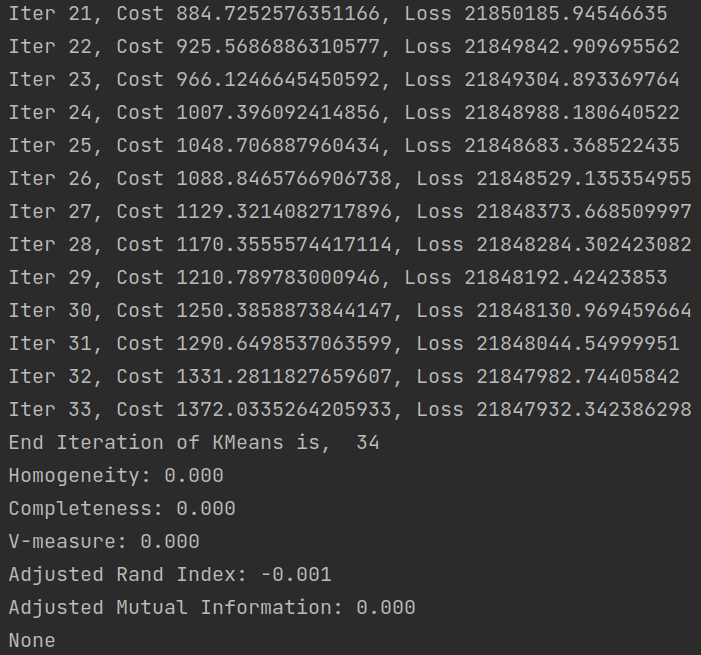

# THU_DM_teamwork2
Code for the Hospital Readmission Clustering Analysis task.

# Data Preprocessing
## Id to description mapping
IDs_mapping.csv文件里的数据去除含NaN的行之后，把 `admission_type_id`， `discharge_disposition_id`，  `admission_source_id` 三种id到description的映射保存在一个字典里<br><br>用法：
```python
import json

with open('data/id2desc.json', 'r') as f:
    id2desc = json.load(f)

id2desc['admission_type_id'].get('0', None) #return None
id2desc['admission_type_id'].get('1', None) #return 'Emergency'
id2desc['admission_source_id'].get('1', None) #return ' Physician Referral'
id2desc['discharge_disposition_id'].get('1', None) #return 'Discharged to home'
```

## Data Cleaning
1. 所有属性都是Categorical型属性，不存在outlier的问题
2. 删除缺失过半的`weight`，`payer_code`，`medical_specialty`属性
3. 删除每个病人独有的id属性`encounter_id`，`patient_nbr`
4. 按题目要求删除`readmitted`属性
5. 对于所有含有 ? 的行进行了删除

## Feature Selection
删除所有entropy小于0.1(所有样本在该属性上几乎或者完全相同)的属性，包括：
 `repaglinide`，
 `nateglinide`，
 `chlorpropamide`，
 `acetohexamide`，
 `tolbutamide`，
 `acarbose`，
 `miglitol`，
 `troglitazone`，
 `tolazamide`，
 `examide`，
 `citoglipton`，
 `glyburide-metformin`，
 `glipizide-metformin`，
 `glimepiride-pioglitazone`，
 `metformin-rosiglitazone`，
 `metformin-pioglitazone`

 ## Feature Transform
 将剩下的所有特征分为三类：nominal、ordinal、numerical，其中
 - nominal: `race`, `gender`, `admission_type_id`, `discharge_disposition_id`, `admission_source_id`,`change`, `diabetesMed`,`metformin`, `glimepiride`, `glipizide`, `glyburide`, `pioglitazone`,
       `rosiglitazone`, `insulin`
 - ordinal: `age`, `diag_1`,
       `diag_2`, `diag_3`, `max_glu_serum`, `A1Cresult`
 - numerical: `time_in_hospital`,
       `num_lab_procedures`, `num_procedures`, `num_medications`,
       `number_outpatient`, `number_emergency`, `number_inpatient`, `number_diagnoses`

对于nominal属性，在使用时可以通过OneHot Encoding将其变为numerical属性，或者使用能够计算含有nominal属性数据的distance metric<br><br>
对于ordinal属性，`diag_123`使用的是ICD9的疾病分类编码，三次诊断涵盖的种类不完全重合，因此将三次诊断的所有数据合并使用LabelEncoder进行编码，`max_glu_serum`, `A1Cresult`为了反映正确的序关系，手动对其进行编码，后续可以直接作为numerical属性使用<br><br>
对于numerical属性不做处理


# Model

在./model/cluster.py中实现了2个聚类方法：

- 基于partitioning的K-Means
- ~~基于Density的DBSCAN~~
- 基于网格的聚类算法Clique


## Distance

因为输入既有离散无序的nominal属性，也有连续有序的numerical属性，所以将闵可夫斯基距离和VDM(Value Difference Metric)结合，形成混合属性的距离，假设有    $n_c$    个有序属性，    $n-n_c$    个无序属性，则对于2个数据点(向量)    $x_i$    和    $x_j$    ，它们之间的混合距离为：

$$
dist_p(x_i,x_j) = (\sum_{u=1}^{n_c}|x_{iu}-x_{ju}|^p + \sum_{u=n_c+1}^{n}VDM_p(x_{iu},x_{ju}))^{\frac{1}{p}}
$$


其中p是范数，我们这次作业取p=2，VDM的定义是在属性u上两个离散值a,b之间的距离：


$$
VDM_p(a,b) =\sum_{i=1}^{k}|\frac{m_{u,a,i}}{m_{u,a}} - \frac{m_{u,b,i}}{m_{u,b}}|^p
$$

用   $m_{u,a}$     表示在属性u上取值a的样本数；    $m_{u,a,i}$     表示在第i个簇中，属性u取值a的样本数。k是聚类簇数。

### Hierarchical Case

特别的，对于Hierarchical聚类,任何时候每个cluster都是一个由若干点合并好的新点,其属性都只有1种取值，所以　 $m_{u,b,i}$　 肯定只能取0或1

当 a=b时，　　$ VDM_p(a,b)  $ 　　= 0

当 a!=b时，


$$
VDM_p(a,b) = \frac{m_{u,a}^{*}}{m_{u,a}^2} + \frac{m_{u,b}^{*}}{m_{u,b}^2}
$$


用   $m_{u,a}^*$     表示当前属性u上取值a的样本数　(因为k在若干次合并后会逐渐减少)；


## Run

```
python main.py --model_name KMeans --max_iter 12
```

kmeans已经可以跑了(Cost是时间花费，Loss是各个点到中心的举例之和):



在10个iteration之后，各个点到中心的举例之和(Loss)基本不会变了，大约45秒跑一个iteration


## Evaluation

对于clustering的evaluation使用的是[sklearn包](https://scikit-learn.org/stable/modules/clustering.html#clustering-performance-evaluation)

| 评价指标           | K-Means       | Clique                 |
| ------------------ | ------------- | ---------------------- |
| 算法性能           | local optimum | simple but low quality |
| 稳定度             |               |                        |
| 复杂度             | **$O(tkn)$**  | **$O(n^2)$** (worst)   |
| Hopkins  Statistic |               |                        |
| 紧凑度             |               |                        |
| 分离度             |               |                        |

其中，t是迭代轮数，k是k-means的簇数，n是样本数量

还有一些算出的数值指标:

- 聚类趋势
  - Hopkins  Statistic

- 聚类质量
  - 紧凑度
  - 分离度
